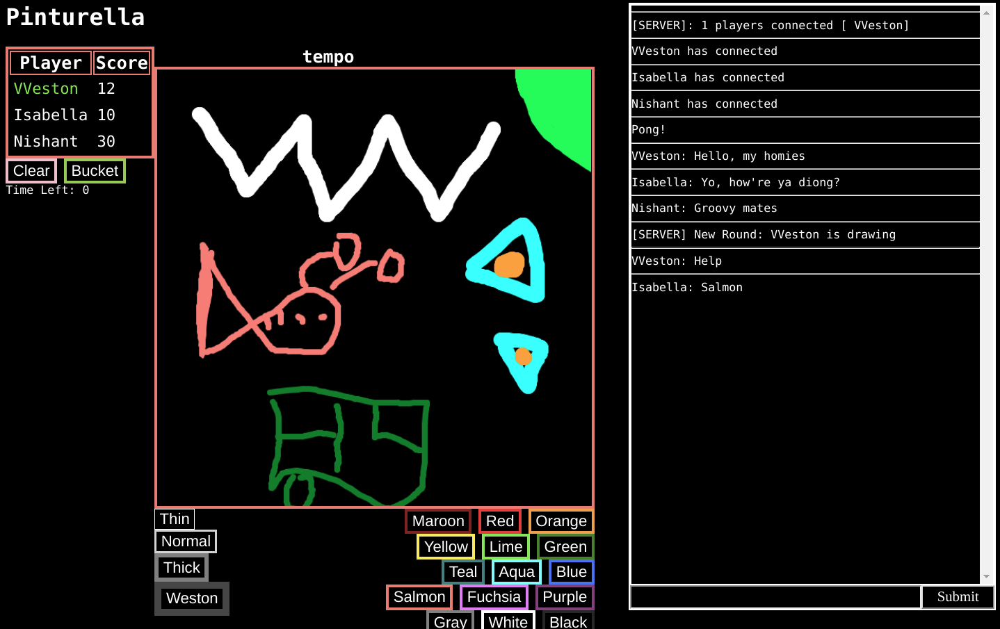

# Pinturella
Pinturella is an alternative to the popular online pictionary game pinturillo2.
Pinturella aims to improve on pinturillo by balancing the scoring system, adding new drawing tools such as floodfill, and a carefully curated database of words.

The app is composed of frontend JavaScript that displays a chat, scoreboard, and drawing canvas which communicates via websockets to a Go backend, which distributes drawing data to all clients and controls the game logic.

